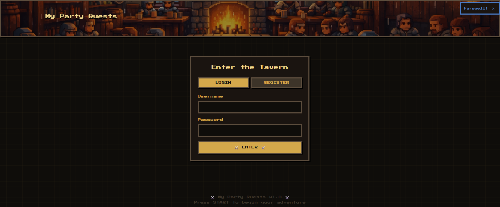
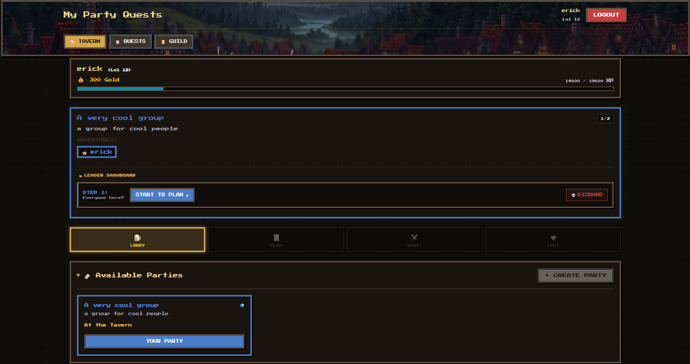
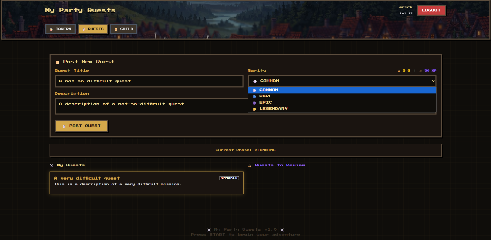
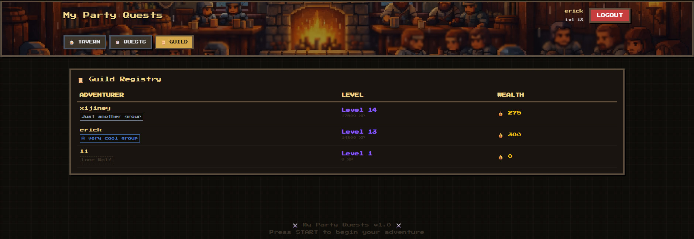

**My Party Quests** is a gamified web application inspired by classic RPGs, built for friends who want to turn everyday challenges into quests and enjoy progression, feedback, and interaction in a playful environment.

The project combines **Spring Boot** and **Spring Security (JWT)** to deliver a complete experience: a REST API with OpenAPI documentation, secure authentication, and a pixel-art themed UI.


## Interface Preview

|  **Login** |  **Dashboard** |
|:---:|:---:|
|  |  |

| **Create Quest** | **Leaderboard** |
|:---:|:---:|
|  |  |

## Table of Contents
- [Overview](#overview)
- [Game Concepts](#game-concepts)
- [Tech Stack](#tech-stack)
- [Installation](#installation)
- [Configuration](#configuration)
- [Running the App](#running-the-app)
- [Deployment (Reference Architecture)](#deployment-reference-architecture)
- [API & Swagger](#api--swagger)
- [Project Structure](#project-structure)
- [Security](#security)
- [Project Status](#project-status)
  
---

## Overview

My Party Quests started as a hands-on learning project designed to turn daily routines into an RPG. Instead of strict productivity, the goal is to make habit-building social and visually rewarding by watching your character level up.

Key Features:

Group System: Join forces with friends to track progress together.

Custom Missions: Transform boring tasks into shareable challenges.

Peer Validation: Review your friends' activity to keep everyone consistent.

Progression: Earn XP and gold for achievements, not just busywork.

---

##  Game Concepts

* **User (Adventurer)**: A registered player with level, XP, and gold.
* **Party**: A team led by an owner (Guild Master).
* **Quest**: A task created by a party member and reviewed by another member.
* **Phases**:

  * **LOBBY** – Party setup and member management
  * **PLANNING** – Quest creation, review, approval, and refinement
  * **EXECUTION** – Quest execution
  * **REVIEW** – Results overview and wrap-up

---

## Tech Stack

* **Java 17**
* **Spring Boot 3**

  * Spring Web MVC
  * Spring Data JPA
  * Spring Security (JWT)
* **PostgreSQL**
* **Swagger / OpenAPI** (springdoc)
* **Maven**

---

##  Installation

### Requirements

* Java JDK 17+
* Maven
* Docker & Docker Compose

### Database Setup

The project uses PostgreSQL via Docker.

```bash
# From the project root
docker-compose up -d
```

Default credentials:

* **User:** `Sprint_user`
* **Password:** `Sprint_pass`
* **Database:** `Sprint_DB`
* **Port:** `5433`

---

##  Configuration

Main application properties (development profile):

```properties
spring.datasource.url=jdbc:postgresql://localhost:5433/Sprint_DB
spring.datasource.username=Sprint_user
spring.datasource.password=Sprint_pass

spring.jpa.hibernate.ddl-auto=update
spring.jpa.show-sql=true

api.security.token.secret=${JWT_SECRET:my-secret-key}
```

---

##  Running the App

With the database running:

```bash
./mvnw spring-boot:run
```

The application will be available at:

```
http://localhost:8080
```

---

## Deployment (Reference Architecture – AWS)

> ⚠️ This AWS setup is documented as a reference architecture.
> Infrastructure was decommissioned after validation to avoid costs.

This setup demonstrates:
- A production-like AWS environment
- Secure configuration management
- Separation between local and production concerns


### Environment Overview

| Component | Technology |
|---------|------------|
| OS | Amazon Linux 2023 |
| Runtime | Spring Boot (JAR) |
| Database | PostgreSQL (Amazon RDS) |
| Profile | `prod` |


### Secrets & Configuration
Sensitive credentials were **not hardcoded**.
Instead, environment variables were injected at runtime via a startup script on the server.

### Production Startup Script (Example)

> This script illustrates how environment variables were injected
> at runtime in a production environment.

```bash
export DB_URL='jdbc:postgresql://<rds-endpoint>:5432/<database>'
export DB_USERNAME='<db-username>'
export DB_PASSWORD='<db-password>'

nohup java -Dspring.profiles.active=prod \
           -Dspring.datasource.url=$DB_URL \
           -Dspring.datasource.username=$DB_USERNAME \
           -Dspring.datasource.password=$DB_PASSWORD \
           -jar app.jar > logs.txt 2>&1 &
```

### Architecture at a Glance

Client → EC2 (Spring Boot – prod) → RDS PostgreSQL


##  API & Swagger

The REST API is fully documented with Swagger/OpenAPI.

* **Swagger UI:**

  ```
  http://localhost:8080/swagger-ui/index.html
  ```

Main API domains:

* **Authentication** – `/auth`
* **Users** – `/user`
* **Parties** – `/parties`
* **Quests** – `/quests`

---

##  Party (Sprint) Flow

1. Create a **Party** (owner becomes Guild Master)
2. Members request to join and get approved
3. Move from **LOBBY → PLANNING**
4. Create **Quests**
5. Move to **EXECUTION** (reviewers assigned)
6. Review, approve, and complete quests
7. Move to **REVIEW** and finalize the sprint
8. Reset to **LOBBY** for a new cycle

---

##  Project Structure

```
├── controller   # REST & MVC controllers
├── service      # Business logic
├── repository   # JPA repositories
├── model        # Entities
├── dto          # Data Transfer Objects
├── security     # JWT & Spring Security config
├── exception    # Global exception handling
└── resources
    └── static    # HTML, CSS, JS, images, assets
```

---

##  Security

* JWT-based authentication
* Role-based access control
* Protected endpoints for party ownership and quest review

---

## Project Status

**MVP Completed (v1.0)**
All core features are implemented and the project is stable for portfolio demonstration.


